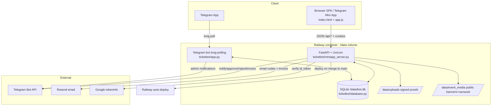

# Budapest Tunderi — Website & Architecture Audit

Read-only audit. No application code, config, DB, or dependencies were modified.
Repository: `git@github.com:asadbekfarmonov/eventmanagement.git` (private). Working dir root paths below are repo-relative.

> IMPORTANT VERSION/DEPLOY NOTE (read first). There are three distinct states:
> - Deployed production (Railway, GitHub-connected to `main`, currently merge commit `267f34c` = content of commit `0609445`): guard role, PDF invoice, admin purchase history, step-by-step booking wizard **with website Telegram login still present**, ticket move/refund requests. `GUARD_WEB_PASSWORD` is set in prod (guard login live).
> - Committed on `main`/deployed: everything in `0609445`.
> - Working tree (UNCOMMITTED, NOT deployed): two further changes — (a) registration made an inline, non-dismissible first wizard step, and (b) the website Telegram login widget fully removed (`tests/test_batch_b2_backend.py` deleted). These are verified locally (pytest 239, e2e 46) but not committed/pushed/merged/deployed.
> This report describes the current **source (working tree)** as the primary truth and flags where production differs.

---

## 1. Project overview

- What it is: "Budapest Tunderi" — an event ticket booking system for nightlife/party events in Budapest, delivered as (1) a public website / Telegram Mini App single-page app and (2) a Telegram bot. Brand copy: nights ("Tunderi" = "nights" in Kazakh) for Central Asian and Russian-speaking students/community in Budapest.
- Business purpose: sell/manage event tickets where payment is by manual bank/Revolut/transfer (proof upload + admin approval), issue QR entry passes, and run door check-in.
- Users: (a) customers (website visitors and/or Telegram users) who book tickets; (b) admins (organizers) who create events, review payments, manage guests; (c) guards (door staff) who only scan/check in tickets.
- Problems solved: collect bookings and attendee names, hold inventory across price tiers, verify manual payments, issue per-attendee QR tickets, check in at the door, track money per payment option, export guest lists.
- Main features/workflows: event catalog, multi-step booking wizard with tiered pricing and discounts, payment-proof upload + admin approval, QR ticket issuance + door check-in, admin dashboard (payments review, events, guests, check-in, import/export, homepage carousel, purchase history), guard role, ticket move/refund requests. See section 3.
- Deployed & operational: YES. Live at `https://budapesttunderi.com` (Railway). `/health` returns 200. Telegram bot runs alongside the web server.

## 2. Technology stack (verified from repo)

- Languages: Python 3.12 (`.python-version` = `3.12`), vanilla JavaScript (ES, no framework/build), HTML, CSS.
- Backend frameworks (`requirements.txt`, exact pins):
  - `fastapi==0.115.6` + `uvicorn==0.34.0` — the Mini App/website server + JSON API (`ticketbot/miniapp_server.py`).
  - `python-telegram-bot==20.7` — the Telegram bot (`ticketbot/app.py`), long-polling.
  - `python-dotenv==1.0.1`, `python-multipart==0.0.20` (uploads), `openpyxl==3.1.5` (xlsx import/export), `qrcode[pil]==7.4.2` (QR), `reportlab==4.2.5` (PDF invoice).
- Frontend: no framework. Static SPA in `ticketbot/miniapp/` (`index.html`, `app.js` ~3000+ lines, `styles.css`, self-hosted `jsqr.js` for QR scanning, `tg-init.js` conditional Telegram SDK loader). Served by FastAPI `StaticFiles` at `/static` and `index.html` at `/`.
- Database: SQLite (stdlib `sqlite3`), single file at `DATABASE_PATH` (prod `/data/bot.db`). No ORM — hand-written SQL in `ticketbot/database.py`. WAL mode, `busy_timeout=5000`, `foreign_keys=ON`. A single shared connection (`check_same_thread=False`) serialized by a process-global `threading.RLock` (every public `Database` method is wrapped via `__getattribute__`).
- Auth: custom. Telegram Mini App `initData` HMAC; website email one-time-code (via Resend) and Google Sign-In; admin password; guard password. Cookie sessions stored hashed in SQLite. See section 4.
- Hosting/deploy: Railway (project `unique-balance`, service `eventmanagement`, env `production`), Nixpacks/railpack auto-detect Python/FastAPI, GitHub-connected auto-deploy from `main`. Persistent volume mounted at `/data`. Custom domain `budapesttunderi.com`. Alternative Oracle VM + systemd deploy scripts in `deploy/oracle/`. Start scripts in `deploy/railway/` (`start_web.sh`, `start_bot.sh`, `start_combined.sh`); `Procfile` (`web` + `worker`).
- External APIs/third-party:
  - Telegram Bot API (`https://api.telegram.org`) — admin notifications + bot; Telegram Web App SDK for Mini App.
  - Resend (`https://api.resend.com/emails`) — transactional email (login codes, approval/rejection, invoice PDF). Optional; no-op if unconfigured.
  - Google Identity — Google Sign-In verified server-side via `https://oauth2.googleapis.com/tokeninfo`.
- Payment providers: NONE integrated (no card processing, no Revolut/Számlázz.hu API). Payments are manual transfers; see section 5.
- Email/notifications: Resend (email) + Telegram Bot (admin/customer messages). Both best-effort.
- File storage: local filesystem on the Railway volume. `UPLOAD_DIR` (default `/data/uploads`) for payment/repost proofs served via signed expiring URLs; `EVENT_MEDIA_DIR` (default `/data/event_media`) for public event banners and carousel images served unsigned/immutable.
- Background jobs/scheduled tasks: no real scheduler. `cleanup_upload_storage()` runs on FastAPI startup and opportunistically on booking requests (`_maybe_run_upload_cleanup`). Notifications and PDF/email run synchronously inside request handlers.

How components communicate: Browser SPA ↔ FastAPI JSON API (`/api/...`) over HTTPS with cookie sessions; FastAPI ↔ SQLite (same process, shared connection); FastAPI → Telegram Bot API / Resend / Google via outbound `urllib`. The Telegram bot process (`app.py`) talks to Telegram via long-polling and shares the same SQLite file. Both processes run in one Railway container (`start_combined.sh`).

## 3. Complete functionality inventory

Legend for status: **Operational (deployed)** = live on prod; **Operational (source, pending deploy)** = present in working tree, not yet deployed; **Manual** = requires admin action; **Removed (source)** = deleted in working tree but still live on prod until next deploy.

Public / customer features:
1. Event catalog / homepage. Lists open events with active tier price and optional banner/map. Access: `/` (Main tab). Frontend: `index.html` main-panel + `app.js`. API: `GET /api/events`, `GET /api/carousel`. Tables: `events`, `carousel_images`. Status: Operational (deployed).
2. Booking wizard (step-by-step). Steps: register → event → guests (counts + names) → repost (rules + per-guest screenshot) → group discount → summary → payment (option + proof + terms). Access: Book tab (`#booking-wizard`). Frontend: `app.js` (`wizardApplicableSteps`, `syncWizard`, `renderSummary`). API: `POST /api/quote` (price preview), `POST /api/book_with_payment` (create pending reservation + upload). Tables: `events`, `reservations`, `attendees`, `users`. Status: Operational (deployed). Registration step: on prod it opens the account modal; in source it is inline & non-dismissible (pending deploy).
3. Tiered pricing + auto tier spillover. Early Bird / Regular Tier-1 / Tier-2, separate boy/girl prices and quantities; booking allocates across tiers (`_allocate_tier_plan`). Status: Operational (deployed).
4. Discounts. (a) Instagram "repost" per-attendee discount with screenshot proof; (b) Girls 2+1 and Boys 3+1 group offers. Combined rule (`_combined_applied_discount`): within a gender take the larger of group vs repost, sum across genders, cap at base total. Status: Operational (deployed). Well tested (`tests/test_database.py`, `tests/test_miniapp_admin_api.py`).
5. Payment option selection. Up to 3 admin-configured options (title + URL/phone text); buyer picks which they used (`payment_slot`). Status: Operational (deployed).
6. Payment proof upload. Image/PDF, magic-byte validated, size-capped (`UPLOAD_MAX_MB`), stored, referenced by signed expiring URL. API in `POST /api/book_with_payment`. Status: Operational (deployed).
7. My tickets. Lists a user's reservations with status, admin note, totals, payment option, per-attendee QR (approved only), and move/refund request buttons. Access: My tickets tab. API: `GET /api/my_tickets`, `GET /api/tickets/{token}/qr`. Status: Operational (deployed).
8. Cancel pending booking (self-service). API: `POST /api/web/cancel` (owner-gated, only `pending_payment_review`). Releases held stock. Status: Operational (deployed).
9. Ticket move/refund requests. Approved ticket with a future event can request a move (≥24h before, `TICKET_MOVE_MIN_HOURS`) or refund (≥72h, `TICKET_REFUND_MIN_HOURS`). Server-enforced windows, owner-gated, idempotent, records `change_request`/`change_request_at`, notifies admins via bot. Status stays `approved` (resolution is Manual). API: `POST /api/web/ticket/request`. Tables: `reservations`. Status: Operational (deployed).
10. Account / registration & login. Email OTP (Resend) and Google Sign-In; profile edit; logout. API: `GET /api/web/auth_config`, `POST /api/web/login/start|verify`, `POST /api/web/email/start|verify`, `POST /api/web/login/google`, `PUT /api/web/profile`, `POST /api/web/logout`, `GET /api/me`. Legacy phone-only register `POST /api/web/register` (gated off when email login enabled unless `LEGACY_WEB_REGISTER_ENABLED`). Tables: `users`, `web_sessions`, `email_login_codes`. Status: Operational (deployed).
11. Website Telegram login (widget). Status: **Removed (source)** — deleted in working tree (endpoint, verifier, config, tests). **Still live on prod** (`POST /api/web/login/telegram`) until the removal is deployed.
12. SEO. `GET /robots.txt`, `GET /sitemap.xml`, OG/canonical meta in `index.html`, branded HTML 404. Status: Operational (deployed).

Admin features (dashboard SPA + API):
13. Admin auth. Password login (`ADMIN_WEB_PASSWORD`) or Telegram `ADMIN_IDS`. API: `POST /api/admin/login`, `GET /api/admin/bootstrap`, `POST /api/admin/logout`. Status: Operational (deployed).
14. Payment review (approve/reject). Pending reservations oldest-first with re-signed proof URLs (or "sent in Telegram" note) + repost proofs. Approve → status approved, notify buyer (Telegram + email), send invoice PDF, delete stored proof; Reject → note required, releases hold, notify. API: `GET /api/admin/reservation/pending`, `POST /api/admin/reservation/approve`, `POST /api/admin/reservation/reject`. Status: Operational (deployed).
15. Money by payment option. Sums approved (and pending) totals per slot for an event. API: `GET /api/admin/payment/totals`. Status: Operational (deployed).
16. Event management. Create (`create_simple`), update fields, upload banner, delete (cascades reservations/attendees + banner file). API: `POST /api/admin/event/create_simple|update|photo|delete`, `GET /api/admin/events`. Tables: `events`. Status: Operational (deployed).
17. Guest management. List/search, add by event, add to reservation, rename, remove (last attendee cancels/deletes reservation), remove by name. API: `GET /api/admin/guests`, `POST /api/admin/guest/add|remove|rename|add_by_event|remove_by_name`. Status: Operational (deployed).
18. Excel import/export. Import guests from `.xlsx` (col A name, col B surname); export guests with status. API: `POST /api/admin/guest/import_xlsx`, `GET /api/admin/guest/export_xlsx`. Status: Operational (deployed).
19. Door check-in. Lookup + check-in by QR token (jsQR camera scan or paste). API: `GET /api/admin/checkin/lookup`, `POST /api/admin/checkin`. Tables: `attendees`. Status: Operational (deployed). Accessible to admin OR guard.
20. Admin purchase history. All reservations (incl. cancelled/rejected) grouped by buyer, searchable by name/email/phone/tg_id/code/event. API: `GET /api/admin/purchase_history`. Status: Operational (deployed).
21. Homepage carousel management. Add/delete carousel images. API: `POST /api/admin/carousel`, `POST /api/admin/carousel/delete`. Tables: `carousel_images`. Status: Operational (deployed).
22. Reservation search. `GET /api/admin/reservations`. Status: Operational (deployed).

Guard feature:
23. Guard role (password-only). `POST /api/guard/login`, `POST /api/guard/logout`, `GET /api/guard/bootstrap`. Session limited strictly to the two check-in endpoints via `_request_guard_or_admin`. Frontend shows only the Check-in tab. Tables: `guard_web_sessions`. Status: Operational (deployed); `GUARD_WEB_PASSWORD` set in prod.

Telegram bot features (`ticketbot/app.py`, long-polling):
24. Classic bot booking flow, `/start` profile, `/events`, `/book` (opens Mini App), `/mytickets`, `/cancel`, admin commands (`/admin`, `/admin_stats`, `/admin_find`, guest commands, `/export`, event edit), inline approve/reject with templated rejection. Admin booking notifications from the Mini App go here (the "message when a user books" the owner values). Status: Operational (deployed). NOTE: the bot's classic flow predates the web wizard and overlaps with it; the product has "fully moved to web" per the owner, but the bot + admin notifications remain active.

Not present / not implemented (do not assume): real payment processing, webhooks, automated refunds/settlement, accounting/invoicing-provider integration, waitlist, booking idempotency key, background job queue/scheduler, CI pipeline.

## 4. User roles and permissions

- Customer (website or Telegram user):
  - View: events, own tickets/QRs, own profile.
  - Create: bookings (pending), attendee names, payment/repost proof uploads, move/refund requests.
  - Edit: own profile (name/surname/phone/email via verification).
  - Delete/Cancel: own pending reservation only.
  - Cannot: approve, export, manage events/guests, see others' data.
- Admin (`ADMIN_IDS` Telegram id OR `ADMIN_WEB_PASSWORD` web session):
  - Full dashboard: view all reservations/guests/history, create/edit/delete events, upload banners/carousel, approve/reject payments, add/remove/rename guests, import/export xlsx, check-in, view money-by-option, purchase history.
- Guard (`GUARD_WEB_PASSWORD` web session):
  - Only: lookup + check in tickets. Explicitly blocked (401/403) on every other `/api/admin/*` endpoint (verified server-side).
- Auth/authorization/sessions:
  - Telegram Mini App: `initData` HMAC verified (`_verify_telegram_init_data`, key = HMAC_SHA256("WebAppData", BOT_TOKEN)), `TELEGRAM_AUTH_MAX_AGE_SECONDS`. `_request_tg_id` never trusts a client id without a valid hash (except dev fallback below).
  - Website: cookie sessions `bt_web_session` (users), `bt_admin_session` (admin), `bt_guard_session` (guard); tokens stored as `sha256:` hashes in `web_sessions`/`admin_web_sessions`/`guard_web_sessions`; expiry `SESSION_COOKIE_MAX_AGE_SECONDS` (default 90 days); cookies httponly, secure on https, samesite=lax.
  - Email OTP: 6-digit code, HMAC-hashed (`EMAIL_LOGIN_SECRET`), `EMAIL_LOGIN_TTL_SECONDS`, `EMAIL_CODE_ATTEMPT_LIMIT`, rate-limited.
  - Google: id_token verified via tokeninfo (aud=`GOOGLE_CLIENT_ID`, iss, exp, email_verified).
  - Dev fallback: `MINIAPP_ALLOW_TG_ID_FALLBACK` permits `?tg_id=` (forgeable) — refused in production by `_enforce_secure_config()` (also requires signing secrets when `REQUIRE_SECURE_CONFIG`/`ENVIRONMENT=production`).
  - Protected routes: all `/api/admin/*` via `_request_admin`; the two check-in routes via `_request_guard_or_admin`; customer routes via `_request_user`; block check via `_ensure_not_blocked` (users.blocked).

## 5. Payments and financial functionality

There is NO payment provider integration. Verified: no Revolut / Revolut Pro / Revolut Merchant API / Számlázz.hu / Stripe / card processing / webhooks / settlement anywhere in code. "Revolut", "Wise", "Bank Transfer" appear only as example labels/placeholders for admin-configured payment options and in docs.

Actual (manual) payment model:
- Payment options: admin sets up to 3 per event: `payment{1,2,3}_title` + `payment{1,2,3}_url` (URL OR free text such as a phone number). No scheme requirement; frontend only linkifies real URLs.
- Payment link generation: none automatic — the admin-entered link/text is shown to the buyer.
- Confirmation logic: buyer uploads a proof file and selects which option (`payment_slot`); reservation is `pending_payment_review`; an admin manually approves or rejects. No webhook, no automatic verification.
- Refund/move: request flags only (`change_request`), resolved manually by the organizer; no automated refund.
- Transaction/revenue tracking: `GET /api/admin/payment/totals` sums approved totals per payment option per event; `list_event_stats` (bot) aggregates approved/pending/held tickets and revenue; `GET /api/admin/purchase_history` lists all reservations with amounts/status.
- Invoice/receipt: on approval, a PDF invoice is generated (`build_invoice_pdf`, reportlab) with line items, discounts, totals, chosen payment option, and one check-in QR per attendee, emailed via Resend (best-effort, never blocks approval). This is the only "receipt".
- Accounting integrations / reporting exports: none beyond the xlsx guest export and the CSV export in the bot (`/export`).

Money representation caveat: prices/totals are stored as SQLite `REAL` (float) and computed with Python floats; there is rounding-drift risk (Forint is integer currency).

## 6. Main user workflows (what is automated vs manual)

- Create event: admin via dashboard `create_simple` (title, caption, datetime, location, tiers/prices/qty, discount toggles, up to 3 payment options, maps link) or via bot conversation; banner uploaded separately. Automated once submitted.
- Configure tickets: 3 tiers with boy/girl prices + quantities; discount toggles. Automated.
- Customer purchase: wizard → quote (auto price) → upload proof + pick payment option + accept terms → `book_with_payment` creates a `pending_payment_review` reservation, holds stock atomically, stores proof, notifies admins (Telegram) and the buyer. Automated up to pending.
- Payment verification: MANUAL — admin reviews proof and approves/rejects.
- After successful payment (approve): status→approved; buyer notified (Telegram if applicable + email); invoice PDF with per-attendee QR emailed; stored proof deleted. Automated on the approve click.
- QR generation: yes — each attendee gets a unique `ticket_token`; QR encodes `{WEB_APP_URL}/checkin/{token}`; rendered via `GET /api/tickets/{token}/qr` (approved only) and embedded in the invoice PDF.
- Ticket delivery: via My tickets page (QR + "Save ticket" PNG) and the emailed invoice PDF. No SMS.
- Entrance validation: admin/guard scans (jsQR) or pastes the QR; `check_in_ticket` marks `checked_in_at` once (idempotent, approved-only). Manual scanning, automated state update.
- Admin manages customers/sales: dashboard tabs (payments, events, guests, check-in, import/export, homepage, history) + bot commands.
- Cancellations/refunds: pending self-cancel is automated (releases stock). Approved move/refund are REQUESTS (flags) resolved manually; there is no automated move/refund execution.

## 7. Database architecture

SQLite, 9 tables (`ticketbot/database.py`, `_init_schema`; idempotent `ALTER`s in `_migrate_schema`). No customer data reproduced here.

- `users`: `id` PK, `tg_id` UNIQUE (positive = Telegram; negative synthetic = website), `name`, `surname`, `email` (default ''), `phone`, `blocked` (0/1), `blocked_reason`.
- `events`: `id` PK, `title`, `event_datetime` (TEXT 'YYYY-MM-DD HH:MM', Europe/Budapest), `location`, `caption`, `photo_file_id` (Telegram file id), tier fields `early_bird_price`/`_girl`/`_qty`, `regular_tier1_*`, `regular_tier2_*`, `status` ('open'), `repost_discount_enabled`/`amount`, `girls_group_offer_enabled`, `boys_group_offer_enabled`, `payment1..3_title`/`_url`, `photo_url` (public banner), `maps_url`.
- `reservations`: `id` PK, `code` UNIQUE, `user_id`→users, `event_id`→events, `ticket_type` (primary tier), `quantity`, `total_price`, `base_total_price`, group/repost discount fields (`girls_group_free_count`, `boys_group_free_count`, `girls_group_discount_amount`, `boys_group_discount_amount`, `group_discount_amount`, `discount_count`, `discount_unit_amount`, `discount_amount`), `boys`, `girls`, `status` (`pending_payment_review`|`approved`|`rejected`|`cancelled`; legacy `pending`), `created_at`, `payment_file_id`, `payment_file_type` (`external`|`photo`|`document`), `admin_note`, `reviewed_at`, `reviewed_by_tg_id`, `hold_applied` (0/1), `payment_slot` (0..3), `change_request` (''|move|refund), `change_request_at`.
- `attendees`: `id` PK, `reservation_id`→reservations, `name`, `surname`, `full_name`, `ticket_token` (UNIQUE index), `repost_discount_applied`, `repost_proof_file_id`, `repost_proof_file_type`, `ticket_tier`, `status` ('reserved'), `checked_in_at`, `checked_in_by_admin_tg_id`, `gender` (boy|girl|unknown).
- `web_sessions`: `token_hash` PK, `user_id`→users (ON DELETE CASCADE), `created_at`, `last_seen_at`.
- `admin_web_sessions`, `guard_web_sessions`: `token_hash` PK, `created_at`, `last_seen_at`.
- `carousel_images`: `id` PK, `image_url`, `position`, `created_at`.
- `email_login_codes`: `email` PK, `code_hash`, `name`, `surname`, `phone`, `created_at`, `expires_at`, `attempts`.

Relationships: reservations↔users, reservations↔events, attendees↔reservations, web_sessions↔users. `PRAGMA foreign_keys=ON`.

Consistency notes / observations:
- FKs are declared but only `web_sessions` uses `ON DELETE CASCADE`; `delete_event` deletes attendees→reservations→event manually; guest removal handles attendee/hold updates and re-derives totals (`_recalculate_reservation_totals`).
- Migrations are ad-hoc `ALTER`s run on every startup, no schema version marker.
- `guard` check-in stores `checked_in_by_admin_tg_id=0` for both a website admin and a guard, so scanner identity is ambiguous.
- Pending reservations hold stock with no TTL: an abandoned/never-reviewed pending booking holds inventory indefinitely (only reject/cancel release it).
- Money in `REAL` (float) — rounding risk.

## 8. API and integration architecture

All routes live in `ticketbot/miniapp_server.py`. Auth in parentheses. (Working-tree list; production also still exposes `POST /api/web/login/telegram`.)

Public / customer:
- `GET /` (SPA), `GET /admin` (redirect to `/?open_admin=1`), `GET /checkin/{token}` (redirect into check-in), `GET /health`, `GET /robots.txt`, `GET /sitemap.xml`.
- `GET /uploads/{filename}?expires&token` (signed proof download), `GET /event-media/{filename}` (public banner/carousel).
- `GET /api/events`, `GET /api/carousel`.
- `GET /api/web/auth_config`; `POST /api/web/register` (legacy, gated); `POST /api/web/login/start`, `POST /api/web/login/verify` (email OTP); `POST /api/web/email/start`, `POST /api/web/email/verify` (change email); `POST /api/web/login/google`; `PUT /api/web/profile`; `POST /api/web/logout`; `POST /api/web/cancel` (user session); `POST /api/web/ticket/request` (user session, rate-limited).
- `GET /api/me`, `GET /api/my_tickets` (user session or Telegram); `GET /api/tickets/{token}/qr` (owner/admin/signature); `POST /api/book_with_payment` (multipart; user session or Telegram; rate-limited); `POST /api/quote` (rate-limited).
Admin (`_request_admin`): `POST /api/admin/login`, `GET /api/admin/bootstrap`, `POST /api/admin/logout`, `GET /api/admin/guests`, `GET /api/admin/reservations`, `GET /api/admin/purchase_history`, `GET /api/admin/events`, `POST /api/admin/guest/{add,remove,rename,add_by_event,remove_by_name}`, `POST /api/admin/guest/import_xlsx`, `GET /api/admin/guest/export_xlsx`, `POST /api/admin/event/{update,delete,create_simple,photo}`, `POST /api/admin/carousel`, `POST /api/admin/carousel/delete`, `GET /api/admin/reservation/pending`, `GET /api/admin/payment/totals`, `POST /api/admin/reservation/{approve,reject}`.
Guard (`POST /api/guard/login`, `/logout`, `GET /api/guard/bootstrap`); check-in (`_request_guard_or_admin`): `GET /api/admin/checkin/lookup`, `POST /api/admin/checkin`.

- Request/response: JSON (Pydantic models for typed bodies) except `book_with_payment`, xlsx import, banner/carousel upload (multipart form). Responses are JSON dicts (`{ok, ...}`) or files (QR PNG, xlsx, PDF via email).
- Auth requirements: as tagged above; cookies + optional Telegram `X-Telegram-Init-Data` header / `?tg_id=` dev fallback.
- External API integrations: Telegram Bot API (outbound `_bot_api`), Resend (`_send_email`/`_send_login_code`), Google tokeninfo (`_verify_google_credential`). All via stdlib `urllib` with timeouts.
- Webhook endpoints: NONE (bot uses long-polling; no inbound payment webhooks).
- Error handling: `HTTPException` with appropriate 4xx/5xx; branded HTML 404 for non-API paths; upload/rollback cleanup on failure; notification/email failures swallowed (best-effort).
- Retry mechanisms: none for outbound calls (single attempt, timeout). SQLite `busy_timeout` handles lock contention.
- Logging: minimal — uvicorn access logs + `print` DB diagnostics in start scripts. No structured logging or error tracker.
- Rate limits: in-memory sliding window (`_enforce_rate_limit`) per scope: quote, booking, ticket_change, email login, admin/guard login, google. Keyed on client-supplied `tg_id` when present (spoofable) else forwarded IP; buckets never evicted (per-process, resets on deploy).
- Suitability for an external AI agent: YES — clean JSON REST API. Admin/guard endpoints are cookie-session gated (or Telegram id). An agent could integrate by holding a session cookie (admin) or a signed ticket signature; there is no API-key/service-account mechanism, so machine access would reuse the admin/guard password session or Telegram `initData`.

## 9. Admin panel and reporting

Single-page admin dashboard (in the same SPA, `#admin-area`, tabs). Capabilities:
- Payments: pending review cards (proof thumbnail/link, attendees, repost proofs, discounts, payment option), approve/reject; "Money by payment option" per-event totals.
- Events: create/edit all event fields, banner upload, delete; discount and payment-option config.
- Guests: search/sort, add (by event or to reservation), rename, remove.
- Check-in: camera scan (jsQR) or paste token, lookup, confirm check-in.
- Add Guest: quick add by event + gender + name.
- Import/Export: xlsx import (name/surname), guest export (name/surname/status, optional status/event filters).
- Homepage: manage carousel images (defaults shown when none).
- History: purchase history grouped by buyer, searchable.
Metrics calculated automatically: revenue/ticket aggregates (`list_event_stats`), per-option approved/pending totals (`payment_option_totals`), held/approved/pending/rejected/cancelled counts. Manually entered: event details, prices, payment options, guest names, approval decisions/notes.

## 10. Current development status

- Completed & deployed (`main`/prod): guard role, PDF invoice on approval, admin purchase history, step-by-step booking wizard, ticket move/refund requests, payment-option selection + money report, carousel, event media/banners, SEO, email/Google login, admin/bot management.
- Completed in source, pending deploy (uncommitted working tree): inline non-dismissible registration step; full removal of website Telegram login.
- TODO/FIXME comments: none found in `ticketbot/` (`grep` returned nothing).
- Known bugs/gaps (verified by inspection): pending reservations have no hold TTL (inventory can be stuck); rate-limit key trusts client `tg_id`; in-memory rate-limit buckets not evicted; guard vs admin check-in attribution both `0`; approval sends two emails (confirmation + invoice); `change_request` has no admin "clear/resolve" endpoint (a set flag blocks re-request permanently); float money rounding risk; N+1 queries in `admin_purchase_history` and pending-review item building.
- Missing integrations: any real payment/card/refund provider; accounting/invoicing provider; CI; error monitoring.
- Docs vs code: `README.md` documents the bot-centric classic flow and Railway/Oracle deploy; the web wizard has largely superseded the classic bot booking UX (both still exist). `.env.example` lists `TELEGRAM_LOGIN_BOT_USERNAME` (relevant only to the now-removed-in-source Telegram login) and payment placeholders (Revolut/bank) that are NOT integrations.
- Technical debt: monolithic `app.js` (~3000+ lines, global state, no build); monolithic `database.py`; ad-hoc migrations without versioning; single shared SQLite connection under a global lock (throughput ceiling); synchronous outbound HTTP in request handlers.

Verified vs assumption: all statuses above are verified from source except whether Resend is configured in prod — `GET /api/web/auth_config` returns `email_login_enabled: true` (so email login works), but which underlying vars back it (`RESEND_*` vs `EMAIL_LOGIN_DEV_MODE`) was NOT inspected to avoid exposing secrets. Treat invoice-email delivery in prod as "enabled per config flag, delivery not independently verified."

## 11. Security and deployment

- Authn/z: multi-mode (Telegram HMAC, email OTP, Google, admin/guard passwords); constant-time password compares (`hmac.compare_digest`); block list; least-privilege guard role; production hardening guard (`_enforce_secure_config`) refuses to start with the forgeable `tg_id` fallback or missing signing secrets when `ENVIRONMENT=production`/`REQUIRE_SECURE_CONFIG`.
- Sensitive info: secrets from env (`.env` gitignored; `.env.example` is a template with placeholders only). No secrets committed. Session tokens stored as sha256 hashes; email codes as HMAC hashes. Payment proofs served via short-lived signed URLs; QR endpoint requires owner/admin/signature.
- Payment verification: manual admin approval; no automated/financial verification (by design).
- Env/secrets: `BOT_TOKEN`, `ADMIN_IDS`, `ADMIN_WEB_PASSWORD`, `GUARD_WEB_PASSWORD` (set in prod), `DATABASE_PATH`, `WEB_APP_URL`, `GOOGLE_CLIENT_ID`, `RESEND_API_KEY`/`RESEND_FROM_EMAIL`, `EMAIL_LOGIN_SECRET`/`UPLOAD_LINK_SECRET`/`TICKET_QR_SECRET`, ticket window + rate-limit + session-age tunables. Do not echo values.
- DB access: single SQLite file on the `/data` Railway volume; WAL; global-lock serialized; `@_rollback_on_error` guards multi-statement writes; atomic tier-decrement with rowcount check to prevent oversell.
- Deployment: Railway GitHub-connected auto-deploy from `main` (build via railpack, Python 3.12), persistent `/data` volume, custom domain, security headers + CSP set in middleware (`add_security_headers`); HTML/JS/CSS `no-store`, static images immutable. Oracle VM systemd alternative provided.
- Monitoring/error logging: none beyond platform/uvicorn logs. No Sentry/metrics. Recommend adding.
- Security concerns (no secrets exposed): rate-limit key spoofable via client `tg_id`; CSP `img-src https:` and `style-src 'unsafe-inline'` are broad; no CI to enforce the test gate; guard/admin scanner attribution ambiguity; pending-hold inventory lock.

## 12. Final architecture summary

Entry points: `bot.py` → `ticketbot.app.main()` (Telegram bot); `ticketbot/miniapp_server.py:app` (FastAPI/uvicorn). Combined process via `deploy/railway/start_combined.sh`.

Read these files first (in order):
1. `ticketbot/miniapp_server.py` — all HTTP routes, auth helpers, uploads, notifications, invoice, rate limiting.
2. `ticketbot/database.py` — schema, migrations, and ALL business logic (pricing, tiers, discounts, holds, guests, sessions, reporting).
3. `ticketbot/models.py` — `Event`, `Reservation`, `User` dataclasses (field source of truth).
4. `ticketbot/miniapp/app.js` + `index.html` + `styles.css` — the SPA (booking wizard, account, admin dashboard, check-in scanner).
5. `ticketbot/app.py` + `ticketbot/services.py` + `ticketbot/config.py` — Telegram bot + service wrappers + config.
6. `tests/` — behavior contracts (esp. `test_database.py`, `test_miniapp_admin_api.py`, `test_payments.py`, `test_ticket_change.py`, `tests/e2e/miniapp-booking.spec.js`).
7. `README.md`, `deploy/railway/`, `deploy/oracle/`, `.env.example` — deploy + config.

## 13. Final capability matrix

| Feature | Current status | Frontend | Backend | Database | External dependency | Relevant files |
|---|---|---|---|---|---|---|
| Event catalog / homepage | Operational (deployed) | Yes | Yes | events, carousel_images | — | miniapp_server.py `/api/events`,`/api/carousel`; app.js; database.py |
| Booking wizard | Operational (deployed) | Yes | Yes | events, reservations, attendees, users | — | app.js (wizard*); miniapp_server.py `/api/quote`,`/api/book_with_payment`; database.py |
| Inline registration step | Operational (source, pending deploy) | Yes | n/a | users, web_sessions | — | app.js, index.html, styles.css |
| Tiered pricing + spillover | Operational (deployed) | Yes | Yes | events, reservations, attendees | — | database.py `_allocate_tier_plan` |
| Repost + group discounts | Operational (deployed) | Yes | Yes | events, reservations, attendees | — | database.py `_combined_applied_discount`,`_group_offer_breakdown` |
| Payment option select + proof upload | Operational (deployed) | Yes | Yes | reservations | filesystem | miniapp_server.py `book_with_payment`; database.py |
| Manual payment approval/reject | Operational (deployed) | Yes (admin) | Yes | reservations, attendees | Telegram, Resend | miniapp_server.py `/api/admin/reservation/*` |
| PDF invoice + QR on approval | Operational (deployed) | n/a | Yes | reservations, attendees | Resend, reportlab | miniapp_server.py `build_invoice_pdf`,`_send_email` |
| QR tickets + door check-in | Operational (deployed) | Yes | Yes | attendees | — | miniapp_server.py `/api/tickets/*`,`/api/admin/checkin*`; jsqr.js |
| My tickets | Operational (deployed) | Yes | Yes | reservations, attendees, events | — | miniapp_server.py `/api/my_tickets` |
| Self-cancel pending | Operational (deployed) | Yes | Yes | reservations | — | miniapp_server.py `/api/web/cancel` |
| Ticket move/refund requests | Operational (deployed) | Yes | Yes | reservations | Telegram | miniapp_server.py `/api/web/ticket/request`; database.py `request_ticket_change` |
| Email OTP login | Operational (deployed) | Yes | Yes | users, web_sessions, email_login_codes | Resend | miniapp_server.py `/api/web/login/*` |
| Google Sign-In | Operational (deployed) | Yes | Yes | users, web_sessions | Google | miniapp_server.py `/api/web/login/google` |
| Website Telegram login | Removed (source); live on prod until deploy | (removed) | (removed) | users, web_sessions | Telegram | (deleted in working tree) |
| Admin dashboard (events/guests) | Operational (deployed) | Yes | Yes | events, reservations, attendees | — | miniapp_server.py `/api/admin/*`; app.js |
| Guest xlsx import/export | Operational (deployed) | Yes | Yes | reservations, attendees | openpyxl | miniapp_server.py `/api/admin/guest/import_xlsx`,`export_xlsx` |
| Money-by-option report | Operational (deployed) | Yes | Yes | reservations | — | miniapp_server.py `/api/admin/payment/totals`; database.py `payment_option_totals` |
| Purchase history | Operational (deployed) | Yes | Yes | reservations, events, users | — | miniapp_server.py `/api/admin/purchase_history` |
| Homepage carousel mgmt | Operational (deployed) | Yes | Yes | carousel_images | filesystem | miniapp_server.py `/api/admin/carousel*` |
| Guard role (check-in only) | Operational (deployed) | Yes | Yes | guard_web_sessions, attendees | — | miniapp_server.py `/api/guard/*`,`_request_guard_or_admin` |
| Telegram bot (classic flow + admin) | Operational (deployed) | n/a | Yes | all | Telegram | ticketbot/app.py |
| Real payment/refund provider | Not implemented | — | — | — | — | — |
| Webhooks / background queue / CI | Not implemented | — | — | — | — | — |

## 14. Context for the next AI agent

What the system does: a manual-payment event ticketing product for Budapest Tunderi. Customers book on a website (SPA served by FastAPI) or via a Telegram bot/Mini App; they pick tiers, enter attendee names, choose an admin-configured payment option, upload a transfer proof, and accept terms. An admin manually approves each payment; on approval the buyer gets a Telegram message and an email with a PDF invoice containing a QR entry pass per attendee. Admins/guards check attendees in at the door by scanning the QR. Admins manage events, guests, discounts, payment options, and view money/purchase reports.

Architecture: one FastAPI app (`ticketbot/miniapp_server.py`) serving both the static SPA (`ticketbot/miniapp/`) and a JSON API, backed by a single SQLite file (`ticketbot/database.py`, no ORM, hand-written SQL, global-lock-serialized shared connection). A separate Telegram bot process (`ticketbot/app.py`) shares the same DB. Both run in one Railway container; Railway auto-deploys on merge to `main`. Files at `/data` (DB, uploads, event media).

Existing business logic (all in `database.py`): tiered inventory with atomic holds and spillover (`_allocate_tier_plan`), the combined discount rule (per-gender greater-of group vs repost, summed across genders, capped — `_combined_applied_discount`), reservation lifecycle (pending→approved/rejected/cancelled) with hold release, guest add/remove/rename with total recalculation, sessions, reporting. Pricing/quote is authoritative on the server (`quote_booking`); the SPA recomputes a preview for display (parity covered by an e2e test).

Important architectural decisions: no framework on the frontend; no ORM; SQLite chosen for simplicity (single instance, one volume); auth is custom and multi-mode; payments are deliberately manual (no PSP); notifications/invoice are best-effort and must never break the core action; production hardening via `_enforce_secure_config`.

Operational features: everything in the capability matrix marked "Operational (deployed)". Guard login is live (`GUARD_WEB_PASSWORD` set). Email login is enabled in prod.

Missing / not implemented: real payment/card/refund/settlement, invoicing-provider or accounting integration, inbound webhooks, background job queue/scheduler, CI, error monitoring, waitlist, booking idempotency. Move/refund and "move to another event" are request flags resolved manually.

Integration points for new features: the JSON REST API under `/api/*`; the SQLite schema in `database.py`; Telegram Bot API (`_bot_api`), Resend (`_send_email`), Google tokeninfo. Machine/agent access would piggyback on an admin/guard cookie session or Telegram `initData` (there is no API key mechanism).

Constraints to respect when implementing new features:
- All DB access goes through `Database` methods (they are serialized by a global RLock); multi-statement writes must be wrapped by `@_rollback_on_error`; schema changes go in BOTH `_init_schema` and idempotent `_migrate_schema`, and any new reservation column must also be added to `models.py` and to the three reservation SELECT lists.
- Never trust client-supplied identity: gate customer routes with `_request_user`, admin with `_request_admin`, check-in with `_request_guard_or_admin`. Do not expand the `tg_id` dev fallback into production.
- Keep notifications/email/PDF best-effort (wrapped, non-blocking).
- Escape all server data rendered into the SPA (`escapeHtml`); the wizard is XSS-safe (names via `.value`, not innerHTML) — preserve that.
- Uploads must keep magic-byte validation, size caps, and signed URLs; public media only under `/event-media/`.
- Run the gate before shipping: `python -m pytest tests/ -q`, `python -m compileall ticketbot`, `npm run test:e2e`. Do not push to `main` directly; open a PR (Railway deploys on merge).
- Money is currently float — if you touch pricing, prefer integer minor units and keep server the single source of truth.

Files to inspect before changing anything: `ticketbot/miniapp_server.py`, `ticketbot/database.py`, `ticketbot/models.py`, `ticketbot/miniapp/app.js` + `index.html`, `ticketbot/app.py`, and the matching tests in `tests/` (unit + `tests/e2e/miniapp-booking.spec.js`).

Pending-deploy caveat: the working tree removes website Telegram login and makes registration inline; production still runs the previous version until those changes are committed and merged. Confirm the deployed commit before relying on either behavior.
